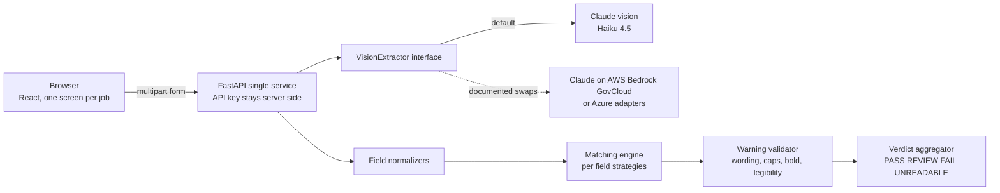

# TTB Label Verifier

An AI-assisted tool that verifies alcohol beverage labels against their application data: it reads a label photo, compares every mandatory field to what the application says, validates the government health warning against 27 CFR part 16, and returns a plain-language verdict in under five seconds, one label at a time or hundreds in a batch.

**Live demo:** https://ttb-label-verifier-production-2026.up.railway.app (kept warm, the first click loads instantly)

## What it does

Every label gets one of four verdicts, always shown as an icon, a word, and a color together:

- **PASS** ("Looks good"): all mandatory fields present, everything matches the application, warning statement valid.
- **REVIEW** ("Please review"): a near match or a low-confidence read that a human should eyeball. A label printing STONE'S THROW when the application says Stone's Throw lands here, not in FAIL.
- **FAIL** ("Problem found"): a hard violation, with the specific reason spelled out ("The first two words must read 'GOVERNMENT WARNING' in all capitals").
- **UNREADABLE** ("Can't read this image, request a better photo"): the photo is too degraded to trust, mirroring what a human examiner would do.

Two modes:

- **One label**: drop in a photo, enter the application values, get a verdict with the measured processing time displayed on screen. Typical time: 3 to 5 seconds.
- **Batch**: upload a manifest CSV plus a folder of images. Results stream in live with a progress bar, summary counts, a triage view that defaults to showing only the labels that need attention, and a one-click CSV export of every result for records or follow-up. Measured: 15 labels in about 8 seconds end to end with bounded concurrency.

## Quickstart (local)

```bash
git clone https://github.com/Lwesson/ttb-label-verifier.git
cd ttb-label-verifier

# backend
pip install -r backend/requirements.txt
cp .env.example .env        # then put your Anthropic API key in .env

# frontend (Node 20+)
cd frontend && npm install && npm run build && cd ..

# run (serves the API and the built UI on one port)
cd backend && uvicorn app:app --port 8000
# open http://localhost:8000
```

Verify a label from the command line:

```bash
cd backend
python cli.py ../corpus/images/clean_bourbon.png --type distilled_spirits \
    --brand "RIDGE & RYE" --class-type "Kentucky Straight Bourbon Whiskey" \
    --abv 45 --net "750 mL"
```

Run a whole batch against a running server:

```bash
cd corpus
curl -X POST http://localhost:8000/api/verify-batch \
    -F "manifest=@batch_manifest.csv" \
    $(for f in images/*.png; do printf ' -F images=@%s' "$f"; done)
```

## Architecture



| Component | Responsibility |
|---|---|
| `backend/ttb/vision/` | The one nondeterministic piece, isolated behind an interface. Everything else is deterministic and unit tested. |
| `backend/ttb/normalize.py` | Pure parsing: ABV and proof, net contents to mL, text folding, warning normalization. |
| `backend/ttb/matching.py` | Per-field strategies: exact, fuzzy with a REVIEW band, partial-read detection, numeric with tolerances. |
| `backend/ttb/warning.py` | The health warning as five separate sub-checks so the agent sees exactly why, not just that, it failed. |
| `backend/ttb/verdict.py` | Type-aware required fields, the table wine exception, confidence and trust gates, final verdict. |
| `backend/ttb/rules.py` | Every threshold and rule in one auditable place, with CFR citations. |
| `backend/app.py` | FastAPI: single verify, streaming batch with bounded concurrency, serves the built UI. |

Design choices worth naming:

- **One service, one container.** The browser never sees the API key; the backend holds it and serves the static UI. One URL to deploy, demo, and review.
- **Batch streams NDJSON.** Each result is pushed as it completes, so a 300-label run shows live progress instead of a spinner. Concurrency is a semaphore (`TTB_BATCH_CONCURRENCY`, default 8); per-label latency stays flat and wall time drops roughly by the concurrency factor (measured 7x on 15 labels).
- **Errors are per-row.** A bad manifest row or a missing image becomes an error entry in the stream; it never aborts the batch.

## How the interview notes drove the design

Each requirement I heard in the stakeholder notes maps to something concrete in the tool:

| What the notes said | What the tool does |
|---|---|
| "Checks that what's on the label matches what's in the application" (Sarah) | A comparison engine, not an extraction dump: every field shows expected vs found with a per-field result. |
| STONE'S THROW vs Stone's Throw "is obviously the same thing... you need judgment" (Dave) | Fuzzy matching with a REVIEW state. Trivial case and punctuation differences are flagged for confirmation, never hard-failed. |
| The warning must be word for word, all caps, bold; a title-case one was rejected (Jenny) | A dedicated validator with five separate sub-checks: presence, wording, capitalization, bold, legibility. The title-case case is in the test corpus and is caught with the capitalization reason spelled out. |
| ABV rules "with some exceptions for certain wine" | Beverage-type-aware required fields. A designated table wine at 7 to 14 percent may omit numeric ABV (27 CFR 4.36) and the tool knows it. |
| The full mandatory field list, not just brand and ABV | Brand, class and type, alcohol content, net contents, name and address, country of origin for imports, and the warning are all extracted and compared. |
| The 30 to 40 second vendor pilot that nobody used; "5 seconds or nobody uses it" (Sarah) | One vision call per label, deterministic local logic, and the measured time displayed in the UI on every result. |
| The firewall blocked the vendor's ML endpoints (Marcus) | The vision engine is behind a `VisionExtractor` interface. The production swap to an in-boundary provider is a one-class change, documented below. |
| Janet's 200-300 label batches | Batch is a first-class flow: manifest upload, live progress, summary counts, a filter that defaults to only the labels needing attention, and a CSV export so the triage results can be acted on outside the tool. |
| Bad photos: angle, glare, lighting (Jenny) | Per-field confidence, an UNREADABLE verdict, and trust gates: a warning that could not be read clearly yields "request a clearer photo," not a false violation. The degraded corpus proves each case. |
| "We value how you fill in gaps independently" | Every gap I filled is written down in the Assumptions section below. |

## Validation rules

All rules are grounded in the regulations and collected in [docs/ttb-regulations-reference.md](docs/ttb-regulations-reference.md):

- **Warning statement** (27 CFR 16.21, 16.22): normalized word-for-word comparison against the canonical text, a strict capitalization check on the GOVERNMENT WARNING prefix, and best-effort visual checks for bold and legibility.
- **Mandatory fields** by commodity (27 CFR parts 4, 5, 7), including the table wine ABV exception, the wine sulfite declaration (27 CFR 4.32(e), reviewed for wine since ppm cannot be read from a photo), and country of origin for imports.
- **Numeric fields**: ABV parsed from any common format, cross-checked against proof (proof = 2 x ABV), with commodity-specific tolerances (wine 1.5 points at or below 14 percent and 1.0 above per 27 CFR 4.36, distilled spirits and malt 0.3). Net contents normalized to mL with unit tolerance.
- Thresholds (fuzzy bands, tolerances, confidence gates) live in `backend/ttb/rules.py` where they can be audited and tuned without touching logic.

## Test corpus and results

The repo ships a 15-label corpus ([corpus/](corpus/)) where every pixel is controlled: 10 exact-text labels each targeting one requirement, plus 4 programmatic degradations (blur, glare over the warning, sharp angle, dim lighting) and a non-bold warning case. Degraded photos list every acceptable verdict, because a badly blurred label can legitimately land in REVIEW or UNREADABLE.

Live results against the real pipeline: **14 of 15 in the accepted verdict** on the default model, median 3.9 seconds per label. Full tables: [docs/corpus-results.md](docs/corpus-results.md). The one miss is the non-bold warning prefix, a documented best-effort limitation, not a silent failure. Reproduce with:

```bash
cd corpus && python validate_live.py            # ~15 live calls, well under a dollar
```

## Model choice, measured

I A/B tested Haiku 4.5 against Sonnet on the full corpus ([docs/corpus-results-sonnet.md](docs/corpus-results-sonnet.md)). Both scored 14/15, but they miss different labels, and the difference decides the default:

- Sonnet detects the non-bold warning prefix that Haiku misses. But Sonnet silently transcribes a title-case "Government Warning" as "GOVERNMENT WARNING", auto-correcting the exact violation the tool exists to catch (reproduced twice; Haiku reads it verbatim twice). A transcriber that fixes defects is unusable for compliance work.
- Sonnet's median latency (5.2s) breaks the 5 second budget; Haiku's (3.9s) does not. Haiku is also roughly 10x cheaper per label.

Default: Haiku 4.5, overridable with `TTB_VISION_MODEL`. The lesson worth stating: for compliance transcription, the more literal model beat the more capable one.

## Assumptions

Gaps in the brief that I filled, and how:

1. **Application data is agent-provided.** COLA integration is out of scope, so "what the application says" comes from the form (single mode) or a manifest CSV (batch mode). In production these values would come from the system of record.
2. **No image persistence.** Labels are processed in memory and never written to disk or stored; each request is ephemeral. This is a deliberate compliance posture, not an accident.
3. **One label per image**, English text, PNG/JPEG/WebP up to 10 MB.
4. **Imports are flagged by the agent** (`is_import`), which switches on the country-of-origin requirement.
5. **Bold and legibility are best-effort visual assessments** by the vision model and are always labeled as such in results.
6. **Confidence thresholds** (when a read is trusted, when a label is unreadable) are judgment calls, kept tunable in `rules.py`, with the reasoning commented.

## Production path and compliance

The prototype calls the Anthropic API directly. The TTB team is on Azure (FedRAMP-certified since the 2019 migration) and blocks outbound traffic to most domains, which is what broke the previous vendor's cloud ML endpoints. So the real question is how this runs inside their boundary, and the `VisionExtractor` interface makes that a one-adapter change:

- **In-boundary deployment, Azure first**: all model access goes through the `VisionExtractor` interface, so moving inside the TTB boundary is one new adapter class with the same prompts and no pipeline, UI, or rule changes. The direct path keeps them on Azure: an Azure OpenAI vision adapter, or Azure AI Document Intelligence for OCR and layout, so nothing leaves their existing accreditation or trips the outbound firewall. If model continuity matters more than staying single-cloud, these exact Claude models also run in-boundary on AWS Bedrock GovCloud (FedRAMP High) or Google Cloud Vertex.
- **Data handling**: no image or result persistence, no PII stored, the API key lives in server-side environment configuration and is rotated on the provider's normal schedule.
- **Scale**: batch throughput is governed by one concurrency knob and the provider rate limit. At the measured per-label latency, a 300-label batch completes in a few minutes at concurrency 8.

## Limitations and trade-offs

Stated honestly, because the failure modes matter as much as the features:

- **Bold detection is unreliable at small type sizes.** Vision models strongly associate all-caps GOVERNMENT WARNING with bold. The corpus documents the miss; the sub-check reports best-effort status rather than pretending certainty.
- **Physical type-size rules (minimum mm by container volume) cannot be measured from a photo** without a known physical scale. The tool checks relative legibility and says so, instead of faking a measurement.
- **Vision LLMs can autocomplete text they know.** A model may "read" the canonical warning through blur because it knows what it should say. The trust gates (low confidence or low readability force REVIEW, never a confident verdict) and the literal-model choice contain this, and the residual risk is documented here on purpose.
- **The corpus is synthetic.** Programmatic rendering controls every character, which is what makes the strict-text cases provable, but real-world label photography is messier than four degradation functions.
- **Composition-dependent disclosures are out of scope.** Items that depend on the recipe or lab data rather than the printed label, an age statement for whisky or brandy under four years, FD&C Yellow No. 5, cochineal or carmine, aspartame, neutral-spirits percentage, appellation of origin, are not verified, because they cannot be confirmed from a photo plus application data alone. The one near-universal exception, the wine sulfite declaration, is checked and reviewed.

## Testing

95 unit tests cover the normalizers, matching strategies, warning sub-checks, verdict logic (including the table wine exception, trust gates, and confidence downgrades), the API endpoints with an injected mock extractor, and corpus generation.

```bash
cd backend && python -m pytest -q
```

`corpus/validate_live.py` runs the corpus against the live model (real API calls) and writes the results tables in `docs/`.

## API

- `GET /api/health` -> `{"status": "ok"}`
- `POST /api/verify` (multipart): `image` file + form fields `beverage_type` (distilled_spirits | wine | malt), `brand_name` (required), `class_type`, `abv_percent`, `net_contents`, `name_address`, `country_of_origin`, `is_import`. Returns the full verdict JSON with per-field results, warning sub-checks, and elapsed seconds.
- `POST /api/verify-batch` (multipart): `manifest` CSV (columns: `filename, beverage_type, brand_name, class_type, abv_percent, net_contents, name_address, country_of_origin, is_import`) plus repeated `images` files. Streams NDJSON: a `start` line, one `result` line per label as it completes, and a `done` line with summary counts. Row-level problems come back as per-row errors and never abort the batch. Capped at 400 rows per request.

## License

MIT, see [LICENSE](LICENSE).
